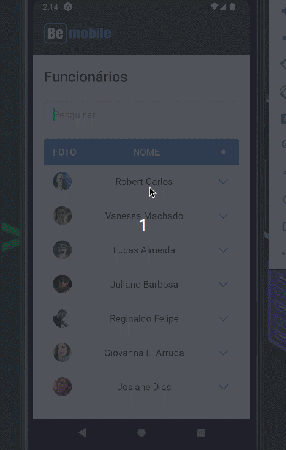
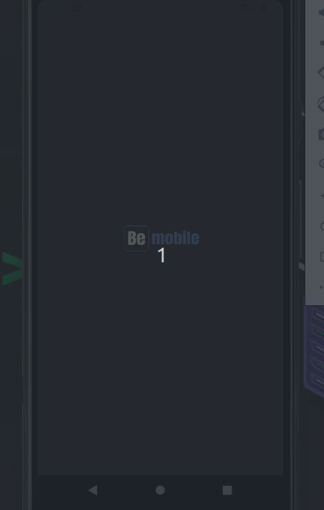

# BeMobile

# Be Mobile Desafio Mobile
Esse desafio na verdade é um teste avaliativo, criar um aplicativo que 
consiste em uma montagem de uma tabela com uma listagem de informações 
dos funcionários como (Nome, Imagem, Cargo, Data de Admissão e Telefone). 
Nessa aplicação podemos também fazer uma pesquisa e filtrar por cada 
funcionário, filtrar por Nome, Cargo e telefone.

## Requerimentos
- Aplicativo foi criado utilizando o Expo com template Bare workflow.
- [yarn](https://yarnpkg.com/getting-started/install) ou [npm](https://www.npmjs.com)
- Como foi pedido para usar o [json-server](https://github.com/typicode/json-server) para rodar a api, foi criado o arquivo server.json dentro do src/server/server.json. É onde tem os dados da api com a rota /employees.
- Para rodar o Json-server, eu criei o comando ("api": "json-server ./src/services/server.json --host 192.168.0.106 --port 3333 --delay 700") no arquivo package.json.
- Detalhe, foi adicionado o IP da maquina para conseguir user a api no emulador e no meu Iphone.
- Caso queira testar aplicação, vá no arquivo onde tem o comando "api" e adicionei o IP da sua maquina.

## Tech Stack

- [React](https://reactjs.org)
- [React Native](https://reactnative.dev)
- [TypeScript](https://www.typescriptlang.org)
- [Expo](https://expo.dev)
- [React Navigation](https://reactnavigation.org)
- [Styled Components](https://styled-components.com/)
- [Phosphor Icon](https://phosphoricons.com/)
- [Axios](https://www.npmjs.com/package/axios)
- [json-server](https://github.com/typicode/json-server)
- [React Native Iphone X Helper](https://www.npmjs.com/package/react-native-iphone-x-helper)
- [React Native Responsive Fontsize](https://www.npmjs.com/package/react-native-responsive-fontsize)

# Tela Home

                    

# Tela Splash Animada

                    
